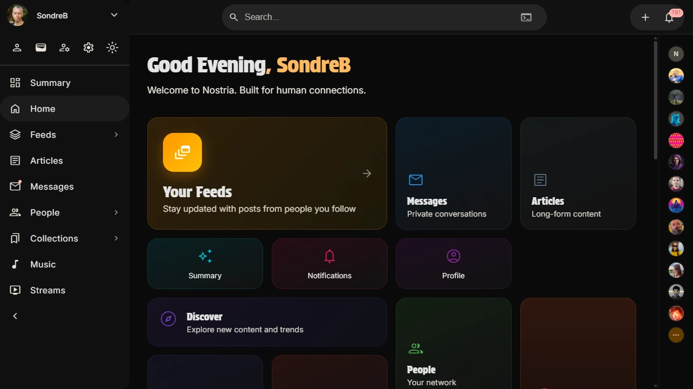

# Nostria


## Your Social Network, built for human connection.

Humans are social beings. We thrive when we connect, share, and build relationships. Social media has the power to bring us closer together - but too often, that natural drive is taken advantage of. Nostria exists to change that dynamic.

Nostria is a platform built on the decentralized Nostr protocol, created to serve people - not exploit them. Our purpose is simple: to be a tool for good. We empower individuals to form new connections and strengthen existing ones, offering features that enrich lives rather than distract from them.

We reject the model where users are treated as the product. Growth will come not from manipulation, but from people genuinely enjoying Nostria because it enhances their lives and relationships.

Joining Nostria is quick, welcoming, and easy - because social media should invite everyone in without barriers. Our design is simple, intuitive, and built to make meaningful interaction effortless.

On Nostria, users own their data, control their profiles, and resist censorship. No one can be silenced here - freedom and transparency are at the core of the experience.

Nostria is **Your Social Network** - a place where lasting engagement comes from meaning, utility, and community.



## Installation

Nostria is accessible as both web app and desktop app.

Web: https://nostria.app

Desktop: https://github.com/nostria-app/nostria/releases

### Linux

```bash
wget https://github.com/nostria-app/nostria/releases/download/v3.1.0/Nostria_3.1.0_amd64.deb
sudo apt install ./Nostria_3.1.0_amd64.deb
```

## Documentation

Documentation of source code is available here: [Nostria DeepWiki](https://deepwiki.com/nostria-app/nostria)

Additional documents here: [docs](docs/)

## Architecture

The client is built on Angular and Angular Material. It is utilizing Tauri to package the app for desktop users.

Nostria is a client for the Nostr protocol, which is a decentralized social network protocol. It allows users to communicate and share information without relying on a central server. The client is designed to be user-friendly and provide a seamless experience for users.

Nostria implements the usage of the Nostr protocol to ensure maximum decentralization and global scalability, without compromising on user experience. The client is designed to be fast, responsive, and easy to use, with a focus on providing a great user experience.

## NIPs

- [x] [NIP-01: Basic protocol flow description](https://github.com/nostria-app/nips/blob/master/01.md)
- [x] [NIP-02: Contact List and Petnames](https://github.com/nostria-app/nips/blob/master/02.md)
- [x] [NIP-04: Encrypted Direct Message](https://github.com/nostria-app/nips/blob/master/04.md)
- [x] [NIP-05: Mapping Nostr keys to DNS-based internet identifiers](https://github.com/nostria-app/nips/blob/master/05.md)
- [x] [NIP-06: Basic key derivation from mnemonic seed phrase](https://github.com/nostria-app/nips/blob/master/06.md)
- [x] [NIP-07: `window.nostr` capability for web browsers](https://github.com/nostria-app/nips/blob/master/07.md)
- [x] [NIP-08: Handling Mentions](https://github.com/nostria-app/nips/blob/master/08.md)
- [x] [NIP-09: Event Deletion](https://github.com/nostria-app/nips/blob/master/09.md)
- [x] [NIP-10: Text Notes and Threads](https://github.com/nostria-app/nips/blob/master/10.md)
- [x] [NIP-11: Relay Information Document](https://github.com/nostria-app/nips/blob/master/11.md)
- [x] [NIP-13: Proof of Work](https://github.com/nostria-app/nips/blob/master/13.md)
- [ ] [NIP-14: Subject tag in text events](https://github.com/nostria-app/nips/blob/master/14.md)
- [x] [NIP-17: Private Direct Messages](https://github.com/nostria-app/nips/blob/master/17.md)
- [x] [NIP-18: Reposts](https://github.com/nostria-app/nips/blob/master/18.md)
- [x] [NIP-19: bech32-encoded entities](https://github.com/nostria-app/nips/blob/master/19.md)
- [x] [NIP-21: `nostr:` URL scheme](https://github.com/nostria-app/nips/blob/master/21.md)
- [x] [NIP-22: Comment](https://github.com/nostria-app/nips/blob/master/22.md)
- [x] [NIP-23: Long-form Content](https://github.com/nostria-app/nips/blob/master/23.md)
- [x] [NIP-24: Extra metadata fields and tags](https://github.com/nostria-app/nips/blob/master/24.md)
- [x] [NIP-25: Reactions](https://github.com/nostria-app/nips/blob/master/25.md)
- [x] [NIP-27: Text Note References](https://github.com/nostria-app/nips/blob/master/27.md)
- [x] [NIP-28: Public Chat](https://github.com/nostria-app/nips/blob/master/28.md)
- [x] [NIP-30: Custom Emoji](https://github.com/nostria-app/nips/blob/master/30.md)
- [x] [NIP-36: Sensitive Content](https://github.com/nostria-app/nips/blob/master/36.md)
- [x] [NIP-38: User Statuses](https://github.com/nostria-app/nips/blob/master/38.md)
- [x] [NIP-39: External Identities in Profiles](https://github.com/nostria-app/nips/blob/master/39.md)
- [x] [NIP-40: Expiration Timestamp](https://github.com/nostria-app/nips/blob/master/40.md)
- [x] [NIP-42: Authentication of clients to relays](https://github.com/nostria-app/nips/blob/master/42.md)
- [x] [NIP-44: Encrypted Payloads (Versioned)](https://github.com/nostria-app/nips/blob/master/44.md)
- [x] [NIP-46: Nostr Remote Signing](https://github.com/nostria-app/nips/blob/master/46.md)
- [x] [NIP-47: Nostr Wallet Connect](https://github.com/nostria-app/nips/blob/master/47.md)
- [x] [NIP-50: Search Capability](https://github.com/nostria-app/nips/blob/master/50.md)
- [x] [NIP-51: Lists](https://github.com/nostria-app/nips/blob/master/51.md)
- [x] [NIP-52: Calendar Events](https://github.com/nostria-app/nips/blob/master/52.md)
- [x] [NIP-53: Live Activities](https://github.com/nostria-app/nips/blob/master/53.md)
- [x] [NIP-55: Android Signer Application](https://github.com/nostria-app/nips/blob/master/55.md)
- [x] [NIP-56: Reporting](https://github.com/nostria-app/nips/blob/master/56.md)
- [x] [NIP-57: Lightning Zaps](https://github.com/nostria-app/nips/blob/master/57.md)
- [x] [NIP-58: Badges](https://github.com/nostria-app/nips/blob/master/58.md)
- [x] [NIP-59: Gift Wrap](https://github.com/nostria-app/nips/blob/master/59.md)
- [x] [NIP-62: Request to Vanish](https://github.com/nostria-app/nips/blob/master/62.md)
- [x] [NIP-65: Relay List Metadata](https://github.com/nostria-app/nips/blob/master/65.md)
- [x] [NIP-66: Relay Discovery and Liveness Monitoring](https://github.com/nostria-app/nips/blob/master/66.md)
- [x] [NIP-68: Picture-first feeds](https://github.com/nostria-app/nips/blob/master/68.md)
- [x] [NIP-70: Protected Events](https://github.com/nostria-app/nips/blob/master/70.md)
- [x] [NIP-71: Video Events](https://github.com/nostria-app/nips/blob/master/71.md)
- [x] [NIP-75: Zap Goals](https://github.com/nostria-app/nips/blob/master/75.md)
- [x] [NIP-78: Application-specific data](https://github.com/nostria-app/nips/blob/master/78.md)
- [x] [NIP-7D: Threads](https://github.com/nostria-app/nips/blob/master/7D.md)
- [x] [NIP-85: Trusted Assertions](https://github.com/nostria-app/nips/blob/master/85.md)
- [x] [NIP-88: Polls](https://github.com/nostria-app/nips/blob/master/88.md)
- [x] [NIP-98: HTTP Auth](https://github.com/nostria-app/nips/blob/master/98.md)
- [x] [NIP-A0: Voice Messages](https://github.com/nostria-app/nips/blob/master/A0.md)
- [x] [NIP-B7: Blossom](https://github.com/nostria-app/nips/blob/master/B7.md)
- [x] [BUD-01: Server requirements and blob retrieval](https://github.com/hzrd149/blossom/blob/master/buds/01.md)
- [x] [BUD-02: Blob upload and management](https://github.com/hzrd149/blossom/blob/master/buds/02.md)
- [x] [BUD-03: User Server List](https://github.com/hzrd149/blossom/blob/master/buds/03.md)

## Opininated Nostr Client

Nostria has opinions, and decisions is being made regarding parts of the Nostr protocol. There are parts that are not implemented and ignored, simply because we disagree.

Here is a list of opinions and decisions made in Nostria:

- [NIP-65: Relay List Metadata](https://github.com/nostria-app/nips/blob/master/65.md) - We are ignoring the READ/WRITE flags for relays and all relays are both read and writes.

- [NIP-96: HTTP File Storage Integration](https://github.com/nostria-app/nips/blob/master/96.md) - This is a "duplicate" specification to Blossom, that has more features, but is additionally more complex. It allows metadata to be stored with the blob, but Nostria will not support this protocol. File storage server list (kind:10096) is therefore
  ignored.
- NIP-58: Badges: Badges should be self-contained on the user's relays. That means both the badge definition and the badge claim should be on the user's relays. This is to ensure that the user has full set of data for their own needs. Maybe Nostria will perform lookup on issuer relays
  to get updated badge definitions, but this is not a requirement. The user should be able to use the badge without relying on the issuer relay.
  That means that Nostria will publish both the badge definition and the badge claim to the user's relays.
- NIP-B0: Web Bookmarking. We are not implementing this NIP, as this is something better left to the web browser.

## Scaling Nostr

Nostria is designed to help Nostr scale. It is implementing the protocol in a way that focuses on decentralization and scalability.

Read more about the journey to scale Nostr globally:

[Scaling Nostr](https://medium.com/@sondreb/scaling-nostr-e50276774367)  
[Discover Relays](https://medium.com/@sondreb/discovery-relays-e2b0bd00feec)

## Recommended IDE Setup

[VS Code](https://code.visualstudio.com/) + [Tauri](https://marketplace.visualstudio.com/items?itemName=tauri-apps.tauri-vscode) + [rust-analyzer](https://marketplace.visualstudio.com/items?itemName=rust-lang.rust-analyzer) + [Angular Language Service](https://marketplace.visualstudio.com/items?itemName=Angular.ng-template).

## Run from Code

Clone the repository.
Install dependencies:

```bash
npm ci --legacy-peer-deps
```

`--legacy-peer-deps` is currently required because the existing lockfile includes a peer dependency conflict around `@nostrability/schemata` and the repository's TypeScript version.

Start the development server:

```bash
npm start
```

Alternative if you want to run the desktop app:

```bash
npm run tauri:dev
```

## Native Build

Build a local desktop installer from the bundled Angular app:

```bash
npm ci --legacy-peer-deps
npm run tauri:build
```

Platform-specific installer commands:

```bash
npm run tauri:build:linux
npm run tauri:build:windows
npm run tauri:build:macos
```

Generated installers are written to `src-tauri/target/**/release/bundle/`.

## Mobile Build

```
bubblewrap init --manifest https://nostria.app/manifest.webmanifest --drectory=src-android

bubblewrap build
```

## ZapStore

```
# Make sure the signing method is added to the .env file

go install github.com/zapstore/zsp@latest

./zsp publish

# Preview using a local web browser.
# Verify the events before publishing.
```

## Classifications

- Accounts - List of accounts that the user has access to.
- Account - This is accounts of the user within the app.
- Users - This is Nostr users. "User" and "Users" refer to Nostr users, not the current user of the app.

## Developer Notes

SVG to ICO: https://redketchup.io/icon-converter

Sizes: 16, 32, 48, 180, 192, 512

Extract PNG from ICO: https://cloudconvert.com/ico-to-png

### App Store Connect

iPad 13" screenshots: 2048 × 2732px
Make browser config 1024x1366 with 2x pixel density.

### Chrome MCP

https://vscode.dev/redirect/mcp/install?name=io.github.ChromeDevTools%2Fchrome-devtools-mcp&config=%7B%22command%22%3A%22npx%22%2C%22args%22%3A%5B%22-y%22%2C%22chrome-devtools-mcp%22%5D%2C%22env%22%3A%7B%7D%7D

## License

This project is licensed under the MIT License. See the [LICENSE](LICENSE) file for details.
